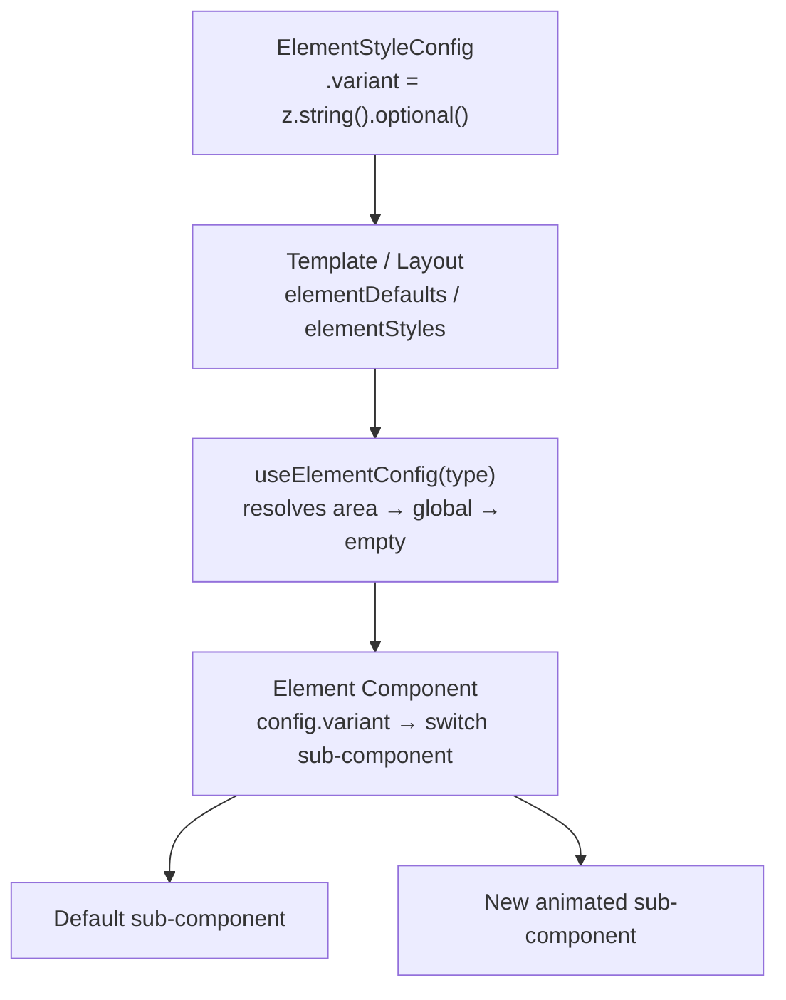

# Advanced Animation Variants — Implementation Plan

> Status: **pending** — ready to implement when picked up.

## Overview

Extend the templating engine with three new animation categories — text effects, animated decorations, and progress/stat widgets — by adding new `variant` sub-components and one additive schema field. The parsing engine, TemplateContext, ElementTransitionWrapper, and GenericSlideRenderer are **untouched**.

---

## Architecture: Why This Needs Almost No Engine Changes

The current engine already has two clean extension points:



- `variant` is already `z.string().optional()` — accepts **any string**, no schema change needed to add new variants
- Element components already pattern-match on `config.variant`; adding a new branch is all that's needed
- `useCurrentFrame()`, `useVideoConfig()`, and `useElementFrameRange(el.id)` are all in scope inside element components — no new hooks needed

The only actual schema addition is an `animation` field on `DecorationSchema` for animated decorations.

---

## What Gets Added

### 1. Typewriter text effect — `variant: "typewriter"`

Applies to: `headline`, `subheadline`, `body-text`

**How it works**: The variant sub-component reads the element's active frame window via `useElementFrameRange(el.id)` and `useCurrentFrame()`. It uses `interpolate()` to reveal characters from `0` to `content.length` over the first ~60% of the active window. A blinking cursor `|` fades out once the text is fully revealed.

```tsx
// src/components/presentation/elements/headline/typewriter.tsx
const localProgress = interpolate(localFrame, [0, activeWindow * 0.6], [0, 1], { extrapolateRight: "clamp" });
const visibleCount = Math.floor(localProgress * text.length);
```

New files:
- `src/components/presentation/elements/headline/typewriter.tsx`
- `src/components/presentation/elements/body-text/typewriter.tsx`

Modified: `headline/index.tsx`, `body-text/index.tsx` — add a `"typewriter"` branch to the variant switch.

---

### 2. Word-reveal — `variant: "word-reveal"`

Applies to: `headline`, `body-text`

**How it works**: Text is split on spaces. Each word gets a staggered `opacity`+`translateY` entrance, offset by `wordIndex / totalWords * staggerWindow`. Uses `interpolate()` per word — fully deterministic frame math, no CSS transitions.

New files:
- `src/components/presentation/elements/headline/word-reveal.tsx`
- `src/components/presentation/elements/body-text/word-reveal.tsx`

Modified: `headline/index.tsx`, `body-text/index.tsx` — add `"word-reveal"` branch.

---

### 3. Staggered bullet list — `variant: "stagger"`

Applies to: `bullet-list`

**How it works**: Each bullet item gets an `opacity`+`translateX` animation, offset by `itemIndex * staggerOffsetFrames`. Items slide in from the left with a cascading delay.

New file: `src/components/presentation/elements/bullet-list/stagger.tsx`

Modified: `src/components/presentation/elements/bullet-list/index.tsx` — add `"stagger"` branch alongside the existing `"stacked"` variant.

---

### 4. Animated fill-bar — `variant: "fill-bar"` on `stat-number`

**How it works**: Reads `el.content` as a 0-100 numeric string. Renders: label + a thin track bar + an accent-colored fill that animates from `0%` to `value%` using `spring()` driven by `localFrame`. The spring gives a natural overshoot-and-settle feel.

```tsx
const fillWidth = spring({ frame: localFrame, fps, config: { damping: 14, stiffness: 80 } });
// interpolated from 0 → targetPercent
```

New file: `src/components/presentation/elements/stat-number/fill-bar.tsx`

Modified: `src/components/presentation/elements/stat-number/index.tsx` — add `"fill-bar"` branch.

---

### 5. SVG progress ring — `variant: "progress-ring"` on `stat-number`

**How it works**: An SVG `<circle>` with `strokeDasharray` animated via `strokeDashoffset` from full to `(1 - value/100) * circumference`. The numeric value counts up alongside it (same `spring()` progress drives both).

New file: `src/components/presentation/elements/stat-number/progress-ring.tsx`

Modified: `src/components/presentation/elements/stat-number/index.tsx` — add `"progress-ring"` branch.

---

### 6. Animated decorations

**Schema change (additive only)** in `src/schema/template.ts`:

```ts
// Add to DecorationSchema:
animation: z.enum(["float", "pulse", "spin", "drift"]).optional(),
animationSpeed: z.number().optional(), // multiplier, default 1.0
```

**Renderer change** in `src/components/presentation/DecorationRenderer.tsx`:

Add `useCurrentFrame()` + `useVideoConfig()` calls and compute a transform per animation type:

- `"float"` — `translateY(sin(t * π * speed) * 8px)` — gentle up/down bob
- `"pulse"` — `scale(1 + sin(t * 2π * speed) * 0.08)` — breathing pulse
- `"spin"` — `rotate(frame * speed * 0.5deg)` — continuous slow spin
- `"drift"` — `translate(sin(t*0.7)*10px, cos(t*0.5)*6px)` — organic floating drift

All driven by `frame / fps` so they're deterministic and render-safe.

---

## Files Changed Summary

| File | Change type |
|---|---|
| `src/schema/template.ts` | Additive — 2 optional fields on `DecorationSchema` |
| `src/components/presentation/DecorationRenderer.tsx` | Add animation transform logic |
| `src/components/presentation/elements/headline/index.tsx` | Add `"typewriter"`, `"word-reveal"` branches |
| `src/components/presentation/elements/body-text/index.tsx` | Add `"typewriter"`, `"word-reveal"` branches |
| `src/components/presentation/elements/bullet-list/index.tsx` | Add `"stagger"` branch |
| `src/components/presentation/elements/stat-number/index.tsx` | Add `"fill-bar"`, `"progress-ring"` branches |
| `src/components/presentation/elements/headline/typewriter.tsx` | New |
| `src/components/presentation/elements/headline/word-reveal.tsx` | New |
| `src/components/presentation/elements/body-text/typewriter.tsx` | New |
| `src/components/presentation/elements/body-text/word-reveal.tsx` | New |
| `src/components/presentation/elements/bullet-list/stagger.tsx` | New |
| `src/components/presentation/elements/stat-number/fill-bar.tsx` | New |
| `src/components/presentation/elements/stat-number/progress-ring.tsx` | New |

## Not Changed

`schema/content.ts`, `TemplateContext.tsx`, `ElementTransitionWrapper.tsx`, `GenericSlideRenderer.tsx`, `transitions/index.ts`, all layout files, `Root.tsx`.

---

## Usage After Implementation

Activating any effect is a one-line change in a template or layout `elementStyles`:

```ts
// In a template's elementDefaults or a layout's elementStyles:
headline:      { variant: "typewriter" }
"body-text":   { variant: "word-reveal" }
"bullet-list": { variant: "stagger" }
"stat-number": { variant: "fill-bar" }    // or "progress-ring"

// In a decoration config:
{ position: "top-right", animation: "float", animationSpeed: 0.8, ... }
```

---

## TODO Checklist

- [ ] `schema` — Add `animation` + `animationSpeed` optional fields to `DecorationSchema` in `src/schema/template.ts`
- [ ] `decoration-renderer` — Update `DecorationRenderer.tsx` to apply frame-driven transforms for float/pulse/spin/drift
- [ ] `typewriter-headline` — Create `headline/typewriter.tsx` + `headline/word-reveal.tsx` and wire into `headline/index.tsx`
- [ ] `typewriter-body` — Create `body-text/typewriter.tsx` + `body-text/word-reveal.tsx` and wire into `body-text/index.tsx`
- [ ] `stagger-bullets` — Create `bullet-list/stagger.tsx` and wire into `bullet-list/index.tsx`
- [ ] `stat-variants` — Create `stat-number/fill-bar.tsx` + `stat-number/progress-ring.tsx` and wire into `stat-number/index.tsx`
